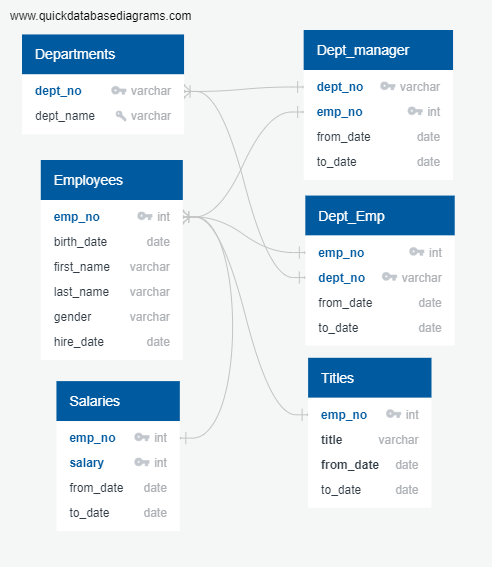
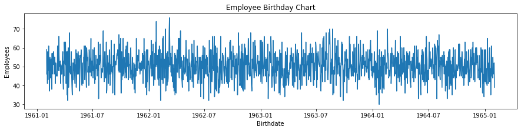

# Pewlett-Hackard Employee Retirement and Mentorship Program
CU-VIRT-DATA-PT-02-2021-U-B-TTH - Employee Database with PostGreSQL - 07  

Paul Do 2021/04/04

## **Overview of the Employee Retirement and Mentorship Program Analysis**

The Purpose of this Analysis is to Identify the number of soon to be retiring employee counts based on employees born between '1952-01-01' AND '1955-12-31' and to pair these retiring Employees with eligible candidates in the Mentorship Program. 

## Resources

- Data Source:   [departments.csv](DATA/departments.csv), [dept_emp.csv](DATA/dept_emp.csv), [dept_manager.csv](DATA/dept_manager.csv), [employees.csv](DATA/employees.csv), [salaries.csv](DATA/salaries.csv), [titles.csv](DATA/titles.csv)
- Query and Database creation files: [schema.sql](schema.sql), [EmployeeDB.txt](EmployeeDB.txt), [bar_charts.ipynb](DATA/bar_charts.ipynb), [Employee_Database_challenge.sql](QUERIES/Employee_Database_challenge.sql)
- Results: [mentorship_eligibility.csv](DATA/mentorship_eligibility.csv), [retirement_titles.csv](DATA/retirement_titles.csv), [retiring_titles.csv](DATA/retiring_titles.csv), [unique_titles.csv](DATA/unique_titles.csv)
- Summary Files: [prior_retirement_titles.csv](DATA/prior_retirement_titles.csv), [internal_candidates.csv](DATA/internal_candidates.csv)
- Software: PostgreSQL 11.11, pgAdmin 4.30, Python 3.8.3, Apache OpenOffice 4.1.8

## Career Company positions held by Retiring/Near Retiring staff Results

The success of our company relies on growing and retaining talent. of the 300,024 employees hired during the lifetime of Pewlett-Hackard, only 17,940 have left the company, for less than 6% of our workforce, which speaks volume of our employee retention 

The Analyst was designed with the following Data Sources: [departments.csv](DATA/departments.csv), [dept_emp.csv](DATA/dept_emp.csv), [dept_manager.csv](DATA/dept_manager.csv), [employees.csv](DATA/employees.csv), [salaries.csv](DATA/salaries.csv), [titles.csv](DATA/titles.csv)



Currently we are looking at 72,458 positions soon to be retired for a total of 90,398 Titles retired/exited in all, which is 4 times more than we have experienced prior our entire corporate exist

| title              |                                     Previous Exit/Retirement |                                           Soon To Retire |  Total |
| ------------------ | -----------------------------------------------------------: | -------------------------------------------------------: | -----: |
| Senior Engineer    |                                                        3,498 |                                                   25,916 | 29,414 |
| Senior Staff       |                                                        3,328 |                                                   24,926 | 28,254 |
| Engineer           |                                                        4,937 |                                                    9,285 | 14,222 |
| Staff              |                                                        4,607 |                                                    7,636 | 12,243 |
| Technique Leader   |                                                          899 |                                                    3,603 |  4,502 |
| Assistant Engineer |                                                          671 |                                                    1,090 |  1,761 |
| Manager            |                                                            0 |                                                        2 |      2 |
|                    | [previous_retiring_titles.csv](DATA/previous_retiring_titles.csv)   17,940 | [retiring_titles.csv](DATA/retiring_titles.csv)   72,458 | 90,398 |

Points to Note from the data analysis

- Pewlett-Hackard will experience a massive number of employee retirements soon across most of their workforce except management.

- We have 72,458 employees retirement retirement_titles window fast approaching, however we only have [1,549 eligible employees for the Mentorship Program](DATA/mentorship_eligibility.csv). This is quite a bit less than the number of employees to replace the vacant positions.

- This graph below shows the age and count of employees, there is no employees younger than the max of this age range, so there has not been any addition younger aged workers.



- The majority of staff soon to retire are Senior Engineer and Senior Staffs. There is little change to the Manager levels and relative small number of changes to Staff.

## Summary

In conclusion, Pewlett-Hackard will be tasked with replacing 30% (72,458 / 240,124) of their current workforce, 

The current group of eligible workers for mentorship is only 1,549, however expanding the birthdates in the query

```
SELECT DISTINCT ON (e.emp_no) e.emp_no,
	e.first_name,
	e.last_name,
	e.birth_date,
	de.from_date,
	de.to_date,
	t.title,
	age(NOW(), e.birth_date) as current_age
INTO internal_candidates
FROM employees as e
INNER JOIN dept_emp as de
ON (e.emp_no = de.emp_no)
INNER JOIN titles as t
ON (e.emp_no = t.emp_no) and (de.to_date = t.to_date)
WHERE e.birth_date >= '1961-02-01' and de.to_date = '9999-01-01'
ORDER BY e.emp_no ASC, de.to_date DESC;
```

in [internal_candidates.csv](DATA/internal_candidates.csv) generated from the SQL above from '1965-01-01' to '1961-02-01' allows as many as 73,705 candidates to be eligible for the mentoring program from an workforce reduced to 167,666 people (240,124 current - 72,458 retiring staff). However that would require P-H to seek to fill new vacancies from current staffs and require retraining for those positions as well, but they will end up with a similar issue again in employment since the age of employees is skewed higher do to the current the youngest age of employee is from 1961. There is a mean of about 50 employees a day that have been hired


and the gradual decline in new hires since the inception of the company in the 1985 until ending of new hires completely in 2001-01-28.


The most ideal solution is for P-H is to seek outside hires with the idea of looking for long term candidates to continue the flattened line of birthdays in hiring.

Most importantly, P-H needs to hire 72,458 employees before the silver tsunami happens to maintain the human resources for business 